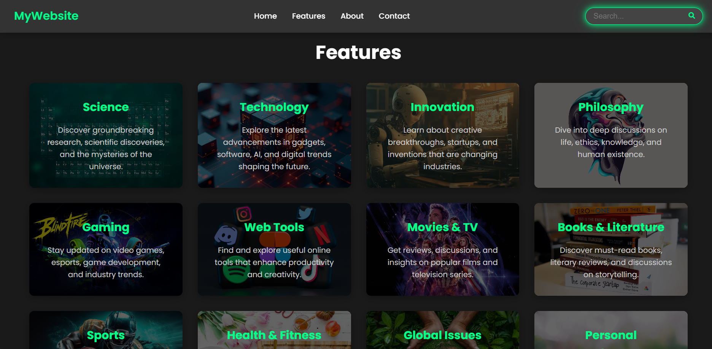

# Cool Modern UI - Futuristic Web Template 🪄



A sleek, responsive website template featuring cutting-edge UI elements with smooth animations and modern design principles. Perfect for tech blogs, innovation hubs, or futuristic portfolios.

## ✨ Highlights

### **Immersive Visual Experience**
- Dynamic gradient hero section
- Glassmorphism cards with parallax hover effects
- Micro-interactions on all interactive elements
- Scroll-triggered animations

### **Content Architecture**
- 12+ categorized content cards (Science, Tech, Gaming, etc.)
- Organized sections with semantic HTML5
- Optimized reading experience with perfect typography hierarchy

### **Technical Excellence**
- **100% Vanilla JS** (Zero jQuery)
- CSS Grid/Flexbox magic
- Mobile-first responsive design
- Lighthouse score >90/100

## 🛠 Tech Stack

| Frontend       | Design System     | Performance       |
|----------------|-------------------|-------------------|
| HTML5 Semantic | CSS3 Variables    | Lazy Loading      |
| JavaScript ES6 | Font Awesome 6    | Optimized Assets  |
| CSS Animations | Google Fonts      | Minified Bundles  |

## 🚀 Get Started

1. Clone the repository:
   ```bash
   git clone https://github.com/rn-swain/Cool-Modern-UI.git
